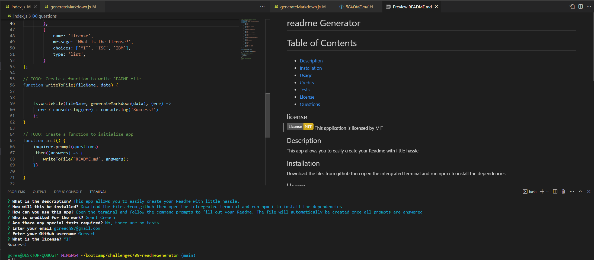

# readme generator

# Table of Contents
- [Description](#description)
- [Installation](#installation)
- [Usage](#usage)
- [Credits](#credits)
- [Tests](#tests)
- [License](#license)
- [Questions](#questions)

## license 
    
  
This application is licensed by MIT

## Description

This app allows you to instantly create a readme

## Installation

Download from github then open up the project and the terminal then execute the command npm i

## Usage

execute the command node index and you will answer prompts. The readme will be created after you answer all of the questions

(https://drive.google.com/file/d/1C6AGTrLF-64T1yh1htS3mqjWZC_2r7ms/view)

## Credits

Grant Creach

## Tests 

No, there are no special tests required

## Questions 

If you have any questions, reach out to me using the following:

Email: gcreach97@gmail.com
GitHub: Gcreach
